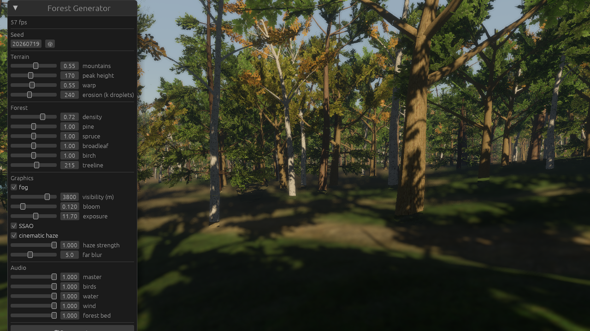

# Bevy World Editor — Forest Generator

A realistic procedural forest world generator built on **Bevy 0.19**. Phase 1: generator +
fly-cam — a ~1×1 km world is generated in seconds (async, with a progress bar) and you fly
through it; tweak parameters in the panel and hit **Regenerate**.



## What it generates

- **Terrain**: domain-warped fBM + ridged massifs, carved by **droplet hydraulic erosion**
  (+ thermal pass) — gullies, valleys, scree. The erosion's flow map drives moisture and
  vegetation.
- **Lakes**: priority-flood depression filling — real mountain lakes at their own spill
  levels, with a custom calm-water shader (Schlick fresnel, Beer–Lambert depth
  absorption, analytic Gerstner normals, shore foam from a baked BFS shore distance).
- **Forest**: 4 species (pine, spruce, oak-like broadleaf, birch) as parametric skeleton
  trees with photographic sprig foliage (EZ-Tree textures, MIT), 4 variants each,
  colour-varied per instance, with a full LOD chain: full mesh → pruned → impostor →
  chunk-merged far tier → crossed billboards to the horizon.
- **Alive layer**: wild trails (Dijkstra over slope cost between lakes and clearings,
  stamped as worn ground), streamed swaying grass, bushes at forest edges, fallen logs,
  stumps, mushroom clusters, boulders rendered with the terrain splat (mossy tops).
- **Look**: 4-layer PBR splat (CC0 ambientCG textures) with triplanar rock, micro-relief
  bump + cavity AO, twig litter and moss; cinematic height-fog post pass, bokeh far blur,
  wind sway in the foliage vertex stage; ambient soundscape (birds / water / wind).

## Running

```bash
cargo run                      # first build is slow (Bevy at opt-level 3)
tools/fetch_textures.ps1       # one-time: downloads the CC0 PBR texture sets (gitignored)
```

Controls: **RMB-drag** look · **WASD+QE** move · **scroll** speed · **Shift** boost.
Panel: seed, terrain/erosion/forest parameters, graphics (fog, haze, DoF, SSAO), audio
mixer, Regenerate.

### Env hooks (headless capture & staging)

| Var | Effect |
|---|---|
| `WED_SHOT=out.png` | render, warm up, save a screenshot, exit |
| `WED_CLIP=dir` (+`_FRAMES`/`_FPS`/`_WARMUP`/`_ORBIT`) | frame-sequence recorder (ffmpeg stitches) |
| `WED_CAM="x,y,z,tx,ty,tz"` | fixed camera pose |
| `WED_EYE="x,z,h,tx,tz[,th]"` | camera at terrain height + h (world-space coords) |
| `WED_TIME=0..1` | stage a time of day (0.5 = noon) — shots freeze the clock |
| `WED_WEATHER=rain\|snow[,intensity]` | stage weather |
| `WED_GODRAYS="int,decay,dens,weight,thr,samples"` | god-ray tuning override |
| `WED_CREATURELINE=1` | park review creatures (deer herd + bird + butterflies) at the first meadow and aim the camera |
| `WED_MODELSHOT=1` | studio contact sheet: every creature model from 4 sides against the sky, camera framed — pair with `WED_SHOT` for a PNG |
| `WED_SEED=n` | world seed |
| `WED_LODLINE=1` | tree LOD review grid instead of the forest |
| `WED_ATMO="..."` | atmospherics tuning override |

NB: when running the binary from outside the repo root set `BEVY_ASSET_ROOT=<repo>` or
the foliage shaders won't load (trees render as bare trunks).

## Architecture

- `crates/worldgen` — pure, deterministic generation (no Bevy): heightfield, erosion,
  lakes, trails, tree skeletons, scatter. `cargo test -p worldgen` (28 tests).
- `src/` — the Bevy app: one plugin per feature (terrain meshing+LOD, splat material,
  water, forest streaming, grass, props, rocks, sky/post, ambience, UI, capture).

## Licenses

Code: MIT or Apache-2.0, at your option. Bundled assets: EZ-Tree leaf textures (MIT,
[dgreenheck/ez-tree](https://github.com/dgreenheck/ez-tree)); ground/bark PBR sets from
[ambientCG](https://ambientcg.com) (CC0, fetched by script — see
`assets/textures/MANIFEST.md`); ambient audio loops from the Warbell project / freesound
(CC0).
